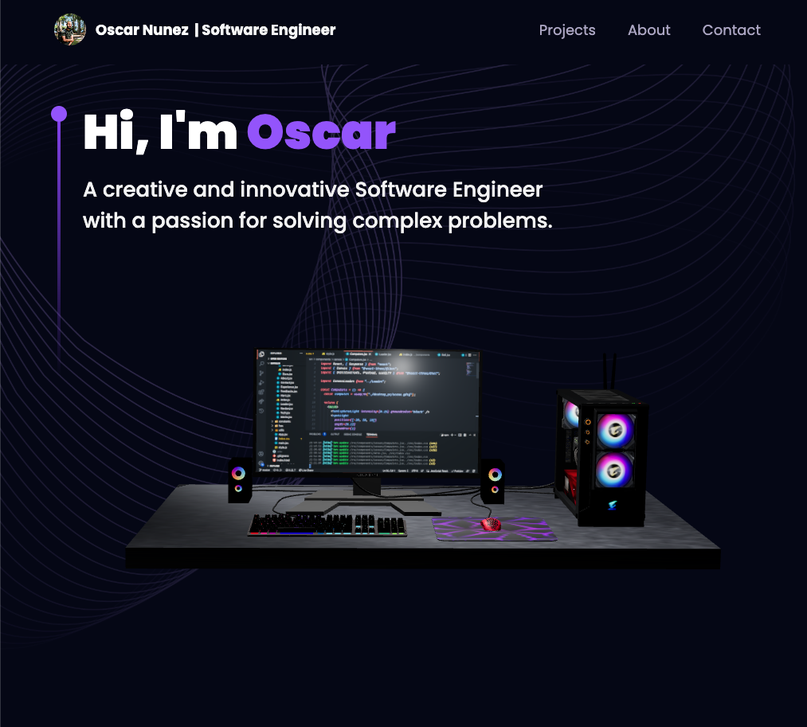

# Oscar's React 3D Developer Portfolio

Welcome to my portfolio! This dynamic platform serves as a window into my professional journey, showcasing my coding prowess, diverse work experiences, and the innovative projects that I've been privileged to contribute to. With a design that comes alive through its 3D interface, this portfolio stands as a testament to my unique approach to problem-solving and my continuous pursuit of learning and growth in the field of software development

## Key Technologies Used

- **ThreeJS**: A powerful 3D graphics library for rendering and animating the 3D models that bring my portfolio to life.
- **React Three Fiber**: A React renderer for ThreeJS, combining the power of React with ThreeJS for easier creation and control of 3D graphics.
- **TailwindCSS**: A utility-first CSS framework used for rapidly building custom user interfaces, responsible for the sleek and modern design of the portfolio.
- **Framer Motion**: An open-source library that provides a comprehensive API for animations, adding motion and transitions throughout the site for a smoother user experience.

## Highlights of the Portfolio

Here are some of the key aspects of my portfolio that you'll discover:

- **Interactive 3D Models**: Explore my work and skills through interactive 3D models, enhanced with custom geometries and various lighting techniques.
- **Responsive Design**: Thanks to TailwindCSS and careful design considerations, the portfolio is fully responsive and optimized for all devices.
- **Performance Optimization**: By leveraging React's Suspense and Preload features, the site offers improved performance, ensuring a smooth and fast browsing experience.
- **Contact Form**: Get in touch with me directly through the site, thanks to an integrated contact form that supports email sending.

Thank you for visiting my portfolio. I hope you enjoy exploring my projects and learning about my professional experience and skills. Please feel free to reach out if you have any questions, or if you're interested in collaborating on a project!

This portfolio design and the technologies used are inspired by [JavaScript Mastery](https://www.youtube.com/@javascriptmastery). Their content has provided valuable guidance and insights throughout the development of this project.

Gaming Desktop PC: This work is based on "Gaming Desktop PC" (https://sketchfab.com/3d-models/gaming-desktop-pc-d1d8282c9916438091f11aeb28787b66) by Yolala1232 (https://sketchfab.com/Yolala1232) licensed under CC-BY-4.0 (http://creativecommons.org/licenses/by/4.0/)
